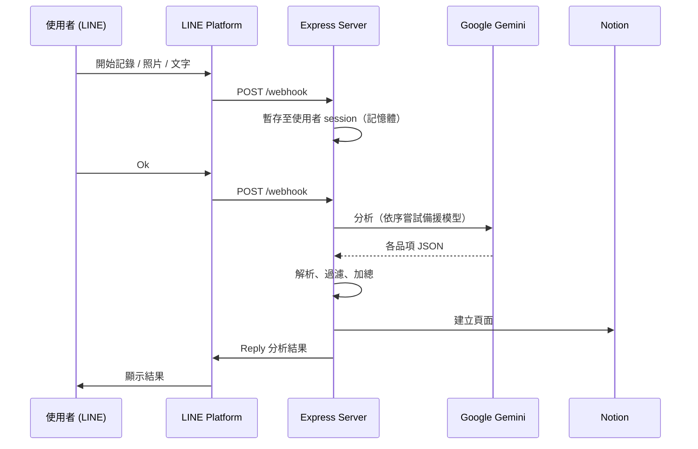

# Food Diary LINE Bot

> 以 LINE 聊天機器人記錄飲食與運動，透過 Google Gemini 估算熱量與營養素，並自動寫入 Notion 資料庫。


## 目錄

- [專案簡介](#專案簡介)
- [功能特色](#功能特色)
- [系統架構](#系統架構)
- [技術堆疊](#技術堆疊)
- [快速開始](#快速開始)
- [環境變數](#環境變數)
- [Notion 資料庫結構](#notion-資料庫結構)
- [部署](#部署)
- [使用說明](#使用說明)
- [HTTP 端點](#http-端點)
- [錯誤處理與重試機制](#錯誤處理與重試機制)
- [自訂設定](#自訂設定)
- [授權條款](#授權條款)

## 專案簡介

Food Diary LINE Bot 是一個個人／家庭用的健康紀錄助手。使用者在 LINE 傳送食物照片或文字描述，機器人透過 Google Gemini 拆解餐點品項並估算熱量與三大營養素，再將結果寫入 Notion；運動紀錄則以文字輸入，由 Gemini 依使用者體態估算消耗熱量。

飲食與運動分別寫入兩個獨立的 Notion 資料庫，並提供排程清理端點，自動封存過期資料。

## 功能特色

### 飲食分析

- **多張照片＋文字合併分析**：同一次紀錄可連續傳送多張照片與多段文字，輸入「Ok」後一次送出分析。
- **品項拆分、程式加總**：提示詞要求 Gemini 只估算「單一品項」（如白飯、滷雞腿、炒高麗菜），由程式負責加總，避免模型自行加總造成誤差；同時會過濾模型自行加上的「總計／合計」項目，防止重複計算。
- **營養素與信心等級**：估算熱量、蛋白質、脂肪、碳水化合物，並回傳信心等級（high / medium / low），多品項合併時取最低等級。
- **台灣外食情境**：提示詞內建台灣常見外食份量與烹調用油、醬料等隱性熱量的估算原則；使用者明確提供份量時以使用者數據為準。

### 運動紀錄

- 以文字輸入運動內容（如「慢跑 30 分鐘」、「深蹲 50 下」），可分多則輸入。
- Gemini 依預設的使用者體態資料估算消耗熱量，並附上簡短估算依據。

### 補登日期

- 在文字中加入日期即可寫入指定日期，支援 `YYYY/MM/DD`、`YYYY-MM-DD`、`MM/DD`、`MM-DD`。
- 未指定年份時以當年度計算；日期字串會從內容中移除後再送交 AI 分析。

### 穩定性

- **多模型備援**：依序嘗試多個 Gemini 模型，遇到 503（滿載）、429（額度用完）或網路錯誤時，逐步延長等待時間後切換下一個模型。
- **忙線保留**：所有模型都暫時無法使用時，保留已上傳的照片與文字 5 分鐘，使用者稍後輸入「Ok」即可重試。
- **寫入失敗只重試寫入**：AI 分析成功但寫入 Notion 失敗時，仍會先回覆分析結果，並保留結果 5 分鐘；輸入「Ok」只重試寫入，不會重新呼叫 Gemini。
- **JSON 容錯解析**：自動移除 Markdown 區塊標記、裁掉 JSON 之後多餘的文字、修補字串內未跳脫的引號；仍解析失敗時會重新請求一次。

### 資料維護

- 提供 `/cleanup` 端點，封存（archive）超過 60 天的飲食與運動紀錄，搭配外部排程服務每日執行。
- 支援 Notion API v5 的 Data Source 架構，自動將 Database ID 轉換為 Data Source ID 後查詢。

### 群組友善

- 機器人僅在收到啟動指令後才會回應，不干擾群組中的一般對話。
- 每位使用者的紀錄狀態獨立，並自動以 LINE 暱稱標記紀錄者，適合家人或朋友共用。
- 全程使用 Reply Token 回覆，不使用 Push Message，不會消耗推播額度。

## 系統架構



## 技術堆疊

| 類別       | 技術                                     |
| :--------- | :--------------------------------------- |
| 執行環境   | Node.js                                  |
| Web 框架   | Express 5                                |
| 通訊介面   | LINE Messaging API（`@line/bot-sdk`）    |
| AI 模型    | Google Gemini（`@google/generative-ai`） |
| 資料庫     | Notion API（`@notionhq/client` v5）      |
| 設定管理   | dotenv                                   |
| 部署／排程 | Render、cron-job.org                     |

## 快速開始

### 前置需求

- Node.js 18 以上
- [LINE Developers](https://developers.line.biz/) 的 Messaging API Channel（取得 Channel Access Token 與 Channel Secret）
- [Google AI Studio](https://aistudio.google.com/) 的 Gemini API Key
- [Notion Integration](https://www.notion.so/my-integrations) 的 Internal Integration Secret，以及兩個資料庫（飲食、運動），結構請見 [Notion 資料庫結構](#notion-資料庫結構)

> [!IMPORTANT]
> 建立資料庫後，需在每個資料庫頁面右上角選單 → **Connections** 加入你的 Integration，否則 API 會回傳找不到資料庫。

### 安裝

```bash
git clone https://github.com/<your-account>/food-diary-linebot.git
cd food-diary-linebot
npm install
```

### 設定

在專案根目錄建立 `.env`，內容請參考 [環境變數](#環境變數)。

### 本機執行

```bash
node app.js
```

服務預設啟動於 `http://localhost:3000`。LINE 需要公開的 HTTPS Webhook，本機開發可使用 [ngrok](https://ngrok.com/)：

```bash
ngrok http 3000
```

再到 LINE Developers Console 將 Webhook URL 設為 `https://<ngrok-domain>/webhook`，並開啟 **Use webhook**。

## 環境變數

| 變數                          | 必填 | 說明                                                                   |
| :---------------------------- | :--: | :--------------------------------------------------------------------- |
| `CHANNEL_ACCESS_TOKEN`        |  ✅  | LINE Channel Access Token                                              |
| `CHANNEL_SECRET`              |  ✅  | LINE Channel Secret，用於驗證 Webhook 簽章                             |
| `GEMINI_API_KEY`              |  ✅  | Google Gemini API Key                                                  |
| `NOTION_API_KEY`              |  ✅  | Notion Integration Secret                                              |
| `NOTION_DATABASE_ID`          |  ✅  | 飲食資料庫 ID                                                          |
| `NOTION_EXERCISE_DATABASE_ID` |  ⚠️  | 運動資料庫 ID；未設定時運動紀錄無法寫入，`/cleanup` 也會略過運動資料庫 |
| `PORT`                        |      | 服務埠號，預設 `3000`                                                  |

範例：

```dotenv
CHANNEL_ACCESS_TOKEN=your_line_channel_access_token
CHANNEL_SECRET=your_line_channel_secret
GEMINI_API_KEY=your_gemini_api_key
NOTION_API_KEY=your_notion_integration_secret
NOTION_DATABASE_ID=your_food_database_id
NOTION_EXERCISE_DATABASE_ID=your_exercise_database_id
PORT=3000
```

## Notion 資料庫結構

欄位名稱需與下表**完全一致**（區分大小寫）。

### 飲食資料庫（`NOTION_DATABASE_ID`）

| 欄位       | 類型   | 內容                 |
| :--------- | :----- | :------------------- |
| `Name`     | Title  | 餐點名稱             |
| `Calories` | Number | 熱量（kcal）         |
| `Protein`  | Number | 蛋白質（g）          |
| `Fat`      | Number | 脂肪（g）            |
| `Carbs`    | Number | 碳水化合物（g）      |
| `User`     | Text   | LINE 暱稱            |
| `Note`     | Text   | 各品項的 AI 估算依據 |
| `Date`     | Date   | 紀錄日期             |

### 運動資料庫（`NOTION_EXERCISE_DATABASE_ID`）

| 欄位       | 類型   | 內容             |
| :--------- | :----- | :--------------- |
| `Name`     | Title  | 運動項目         |
| `Calories` | Number | 消耗熱量（kcal） |
| `User`     | Text   | LINE 暱稱        |
| `Note`     | Text   | AI 估算依據      |
| `Date`     | Date   | 紀錄日期         |

## 部署

### Render

1. 將程式碼推送至 GitHub。
2. 在 Render 建立 **Web Service** 並連結該 Repository。
3. Build Command：`npm install`；Start Command：`node app.js`。
4. 在 **Environment** 頁面設定所有[環境變數](#環境變數)。
5. 部署完成後，將 LINE Webhook URL 更新為 `https://<your-service>.onrender.com/webhook`。

> [!TIP]
> 升級 Notion SDK 等相依套件後若出現版本不符的錯誤，可使用 **Manual Deploy → Clear build cache & deploy** 重新部署。

### 排程（cron-job.org）

| 用途             | URL                                 | 建議頻率             |
| :--------------- | :---------------------------------- | :------------------- |
| 防止免費方案休眠 | `GET https://<your-domain>/`        | 每 5–10 分鐘         |
| 封存過期資料     | `GET https://<your-domain>/cleanup` | 每日一次（如 04:00） |

## 使用說明

### 指令一覽

| 指令                   | 適用狀態 | 說明                                            |
| :--------------------- | :------- | :---------------------------------------------- |
| `開始記錄`、`分析熱量` | 任何時候 | 開始飲食紀錄                                    |
| `運動記錄`、`運動紀錄` | 任何時候 | 開始運動紀錄                                    |
| `Ok`、`分析`、`計算`   | 紀錄中   | 送出分析並寫入 Notion；忙線或寫入失敗後用來重試 |
| `取消`、`結束`         | 紀錄中   | 放棄本次紀錄                                    |

> 重新輸入啟動指令會捨棄目前尚未送出的紀錄，並開始新的一次紀錄。

### 飲食紀錄

1. 輸入 `開始記錄`。
2. 傳送食物照片（可多張）或文字說明，例如「白飯只吃一半」、「另外喝了一杯無糖紅茶」。
3. 需要補登時，在文字中加上日期，例如 `12/25 聚餐吃火鍋`。
4. 輸入 `Ok`，機器人回覆餐點名稱、熱量與三大營養素，並寫入 Notion。

### 運動紀錄

1. 輸入 `運動紀錄`。
2. 輸入運動內容，可分多則，例如 `慢跑 30 分鐘`、`12/20 游泳 1 小時`。
3. 輸入 `Ok`，機器人回覆運動項目與消耗熱量，並寫入 Notion。

### 紀錄狀態有效時間

- 紀錄狀態自輸入啟動指令起保留 **5 分鐘**，逾時自動清除。
- 忙線或寫入失敗後，保留時間會從當下重新計算 5 分鐘。此期間只接受 `Ok` 與 `取消`／`結束`，其他訊息會被忽略。

## HTTP 端點

| 方法   | 路徑       | 說明                                                 |
| :----- | :--------- | :--------------------------------------------------- |
| `GET`  | `/`        | 健康檢查（Keep-alive），回傳固定字串                 |
| `GET`  | `/cleanup` | 封存 `Date` 早於 60 天前的飲食與運動紀錄             |
| `POST` | `/webhook` | LINE Webhook 接收端點，經 `line.middleware` 驗證簽章 |

## 錯誤處理與重試機制

| 情境                                   | 行為                                                  |
| :------------------------------------- | :---------------------------------------------------- |
| Gemini 回傳 503 / 429 / `fetch failed` | 等待 1 秒、2 秒…後依序切換備援模型                    |
| 所有模型皆無法使用                     | 保留照片與文字 5 分鐘，提示使用者稍後輸入 `Ok` 重試   |
| Gemini 回傳的 JSON 無法解析            | 嘗試修復後仍失敗則重新請求一次；再失敗即結束本次紀錄  |
| 寫入 Notion 失敗                       | 先回覆分析結果，保留結果 5 分鐘；輸入 `Ok` 僅重試寫入 |
| 其他錯誤                               | 回覆「分析失敗」並結束本次紀錄                        |

Gemini 模型的嘗試順序定義於 `app.js` 的 `GEMINI_MODELS`：

```js
const GEMINI_MODELS = [
    "gemini-3.7-flash",
    "gemini-3.5-flash-lite",
    "gemini-3.1-flash-lite",
];
```

## 自訂設定

以下設定目前寫在 `app.js` 中，修改後需重新部署：

| 常數／位置                    | 預設值                              | 說明                       |
| :---------------------------- | :---------------------------------- | :------------------------- |
| `GEMINI_MODELS`               | 見上方                              | Gemini 模型與備援順序      |
| `defaultUserStats`            | `女性，身高 XXX 公分，體重 XX 公斤` | 運動熱量估算使用的體態資料 |
| `SESSION_TTL_MS`              | `5 * 60 * 1000`                     | 紀錄狀態保留時間           |
| `daysToKeep`（`/cleanup` 內） | `60`                                | 資料保留天數               |
| `FOOD_ANALYSIS_PROMPT`        | —                                   | 飲食分析提示詞             |

## 授權條款

本專案採用 [MIT License](https://opensource.org/licenses/MIT) 授權。
